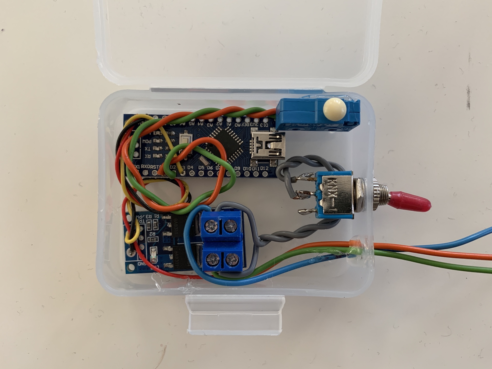
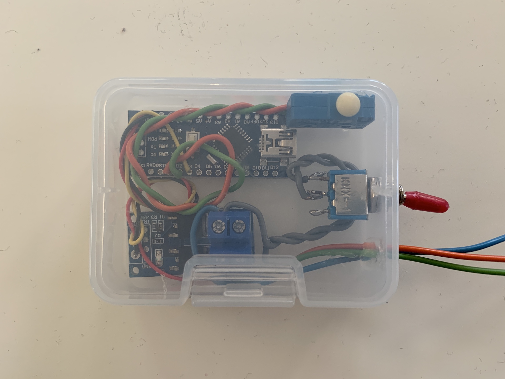
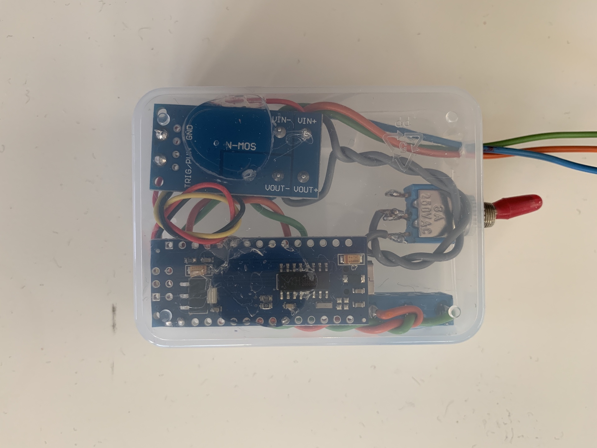

# Brake Light Flasher Pro (English)

For use on all motorcycles, ATVs and cars without bulb monitoring.

## Warning

Check local vehicle laws to see if the Brake Light Flasher Pro are allowed in your country/state, as the Brake Light Flasher Pro can save lives but may be illegal in some countries. If the use of brake light flasher is restricted in your country or state, we recommend setting the device to mode "1" which simulates manual brake light flashing (3 slow flashes). **You are responsible for complying with the laws in your area.**

## Specifications

- Flash patterns: 11 modes + bypass mode

## Hardware

I used these parts:

- Arduino Nano v3.0 [Amazon Link](https://www.amazon.de/AZDelivery-Atmega328-gratis-Arduino-kompatibel/dp/B01LWSJBTD)
- MOSFET Driver Module [Amazon Link](https://www.amazon.de/gp/product/B089JYL5C6)
- End switch (required)
- On/Off switch (optional for bypass)
- some wires
- a little plastic box

The end switch ist connected on PIN 2 and GND. The MOSFET Driver is connected on PIN 3 and GND. The On/Off switch is bridgeing the IN- and OUT- connection.



_Image 1: Module opened_



_Image 2: top view_



_Image 3: bottom view_

## Installation

Install this device at your own risk.

For motorcycles, it is recommended that you make the connections under the seat near the brake light system. For cars, make the connections on the cable that goes directly to the third brake light.

Depending on the hardware used, the ground line is interrupted in the depiction shown.

```
                   +-------+                                          
                   |       |                                          
                   |  BLF  |                                          
                   |       |                                          
                   |  PRO  |                                          
                   |       |                                          
                   +-------+                                          
                     | | |                                            
 Ground              | | |                     +------+               
 --------------------| |---------------------- |      |               
                         |                     | Bulp |               
 ------------------------|-------------------- |      |               
 Plus                                          +------+               
```

## Operation

The device is fully functional after installation. If you want, you can easily change the flashing mode with a few button presses on the module.

Here is the list of available modes:

| Mode # | Frequency (Hz) | Duration (s) | Number of flashes |
|---|---|---|---|
| 0 (bypass mode) | 0 | - | 0 |
| 1 | 1.5 | 2 | 3 |
| 2 | 1.5 | 5 | 8 |
| 3 | 3 | 2 | 6 |
| 4 | 3 | 5 | 15 |
| 5 | 6 | 2 | 12 |
| 6 | 6 | 5 | 30 |
| 7 | 9 | 2 | 18 |
| 8 | 9 | 5 | 45 |
| 9 | 12 | 2 | 24 |
| 10 | 12 | 5 | 60 |
| 11 (delay warning signal) | Changes from high to low frequency | 3 | 8 |

### Notes

- In bypass mode, the brake light functions in the same way as without the module installed.

- Modes 1 to 10 start with a 1-second pulse, which ensures that the brake light reaches maximum brightness within a very short time. Then the light flashes with a duty cycle of 75% (75% ON, 25% OFF) for best visibility (flashing light without loss of brightness).

- In modes 1 to 11, the brake light remains on after the flashing cycle is complete for as long as you apply the brake.

- Modes 7 to 10 are only suitable for LED lights, as incandescent lamps cannot reproduce the flashing speed of these modes.

- The setting is stored in flash memory so you don't have to reprogram the unit if you disconnect the battery.

### Change flashing mode

- Turn the ignition key to ON and the engine stop switch to RUN, apply and hold the brake to illuminate the brake light.

- Wait until the flashing cycle is complete and the brake light is on steady. Do not release the brake at this time, but wait until the programming is complete.

- Press and hold the button for about 5 seconds until the brake light goes out. This confirms that you are in programming mode.

- Release the button. The light will illuminate and remain on. This means that the "0" mode is selected. If you want to leave the module in bypass mode, release the brake and the setting will be saved.

- To select the next mode, touch and hold the button until the light goes out. When you release the button, the next mode is selected and you will see the flashing light pattern for that mode.

- When the desired mode is selected, release the brake and the setting will be saved.

## Warranty

No warranty and/or guarantee is provided. All modifications are at your own risk.

---

# Brake Light Flasher Pro (German)

Zur Verwendung an allen Motorrädern, ATVs und Autos ohne Glühlampenüberwachung.

## Warnung

Überprüfen Sie die örtlichen Fahrzeuggesetze, um zu sehen, ob der Brake Light Flasher Pro in Ihrem Land/Bundesstaat erlaubt sind, da der Brake Light Flasher Pro Leben retten, aber in einigen Ländern illegal sein kann. Wenn die Verwendung von Bremslichtblitzern in Ihrem Land oder Staat eingeschränkt ist, empfehlen wir, das Gerät auf den Modus "1" einzustellen, der ein manuelles Blinken des Bremslichts simuliert (3 langsame Blitze). **Sie sind für die Einhaltung der Gesetze in Ihrer Region verantwortlich.**

## Spezifikationen

- Blinkmuster: 11 Modi + Bypass-Mode

## Hardware

Ich habe diese Bauteile verwendet:

- Arduino Nano v3.0 [Amazon Link](https://www.amazon.de/AZDelivery-Atmega328-gratis-Arduino-kompatibel/dp/B01LWSJBTD)
- MOSFET Treiber Modul [Amazon Link](https://www.amazon.de/gp/product/B089JYL5C6)
- Taster (benötigt)
- An-/Aus-Schalter (optional für Bypass)
- einige Drähte
- eine kleine Plasikbox

Der Endschalter ist an PIN 2 und GND angeschlossen. Der MOSFET-Treiber ist an PIN 3 und GND angeschlossen. Der An-/Aus-Schalter überbrückt die IN- und OUT-Verbindung.


_Image 1: Modul geöffnet_


_Image 2: Draufsicht_


_Image 3: Unten_

## Installation

Die Installation dieses Geräts erfolgt auf eigene Gefahr.

Bei Motorrädern empfiehlt es sich, die Anschlüsse unter dem Sitz in der Nähe der Bremslichtanlage vorzunehmen. Bei Autos stellen Sie die Verbindungen an dem Kabel her, das direkt zur dritten Bremsleuchte führt.

Abhängig von der eingesetzten Hardware wird in der abgebildeten Darstellung die Masse-Leitung unterbrochen.

```
                   +-------+                                          
                   |       |                                          
                   |  BLF  |                                          
                   |       |                                          
                   |  PRO  |                                          
                   |       |                                          
                   +-------+                                          
                     | | |                                            
 Ground              | | |                     +------+               
 --------------------| |---------------------- |      |               
                         |                     | Bulp |               
 ------------------------|-------------------- |      |               
 Plus                                          +------+               
```

## Betrieb

Das Gerät ist nach dem Einbau voll funktionsfähig. Wenn Sie möchten, können Sie den Blinkmodus mit ein paar Knopfdrücken auf dem Modul leicht ändern.

Hier ist die Liste der verfügbaren Modi:

| Modus # | Frequenz (Hz) | Dauer (s) | Anzahl der Blitze |
|---|---|---|---|
| 0 (Bypass-Modus) | 0 | - | 0 |
| 1 | 1.5 | 2 | 3 |
| 2 | 1.5 | 5 | 8 |
| 3 | 3 | 2 | 6 |
| 4 | 3 | 5 | 15 |
| 5 | 6 | 2 | 12 |
| 6 | 6 | 5 | 30 |
| 7 | 9 | 2 | 18 |
| 8 | 9 | 5 | 45 |
| 9 | 12 | 2 | 24 |
| 10 | 12 | 5 | 60 |
| 11 (Verzögerungswarnsignal) | Ändert von hoher zu niedriger Frequenz | 3 | 8 |

### Hinweise

- Im Bypass-Modus funktioniert das Bremslicht auf die gleiche Weise wie ohne das installierte Modul.

- Die Modi 1 bis 10 beginnen mit einem 1-Sekunden-Impuls, der sicherstellt, dass das Bremslicht innerhalb kürzester Zeit die maximale Helligkeit erreicht. Dann blinkt das Licht mit einer Einschaltdauer von 75% (75% EIN, 25% AUS) für beste Sichtbarkeit (Blinklicht ohne Helligkeitsverlust).

- In den Modi 1 bis 11 bleibt das Bremslicht nach Beendigung des Blinkzyklus so lange eingeschaltet, wie Sie die Bremse betätigen.

- Die Modi 7 bis 10 sind nur für LED-Leuchten geeignet, da Glühlampen die Blinkgeschwindigkeit dieser Modi nicht reproduzieren können.

- Die Einstellung wird im Flash-Speicher gespeichert, so dass Sie das Gerät nicht neu programmieren müssen, wenn Sie die Batterie abgeklemmt haben.

### Blinkmodus ändern

- Stellen Sie den Zündschlüssel auf ON und den Motorstoppschalter auf RUN, betätigen Sie die Bremse und halten Sie sie gedrückt, damit das Bremslicht aufleuchtet.

- Warten Sie, bis der Blinkzyklus beendet ist und die Bremsleuchte konstant leuchtet. Lassen Sie die Bremse zu diesem Zeitpunkt nicht los, sondern warten Sie, bis die Programmierung abgeschlossen ist.

- Halten Sie die Taste etwa 5 Sekunden lang gedrückt, bis die Bremsleuchte erlischt. Dies bestätigt, dass Sie sich im Programmiermodus befinden.

- Lassen Sie die Taste los. Das Licht leuchtet auf und bleibt eingeschaltet. Dies bedeutet, dass der Modus "0" gewählt ist. Wenn Sie das Modul im Bypass-Modus belassen wollen, lassen Sie die Bremse los und die Einstellung wird gespeichert.

- Um den nächsten Modus zu wählen, berühren Sie die Taste und halten Sie sie gedrückt, bis die Leuchte erlischt. Wenn Sie die Taste loslassen, wird der nächste Modus ausgewählt und Sie sehen das Blinklichtmuster für diesen Modus.

- Wenn der gewünschte Modus ausgewählt ist, lassen Sie die Bremse los und die Einstellung wird gespeichert.

## Gewährleistung

Es wird keine Garantie und/oder Gewährleistung übernommen. Alle Modifikationen erfolgen auf eigenes Risiko.
